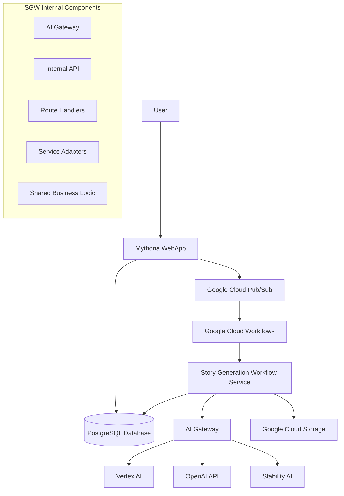
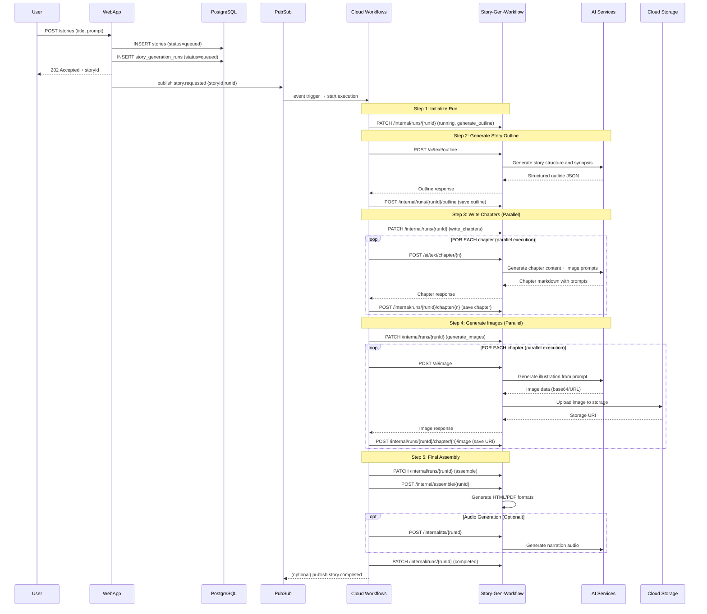
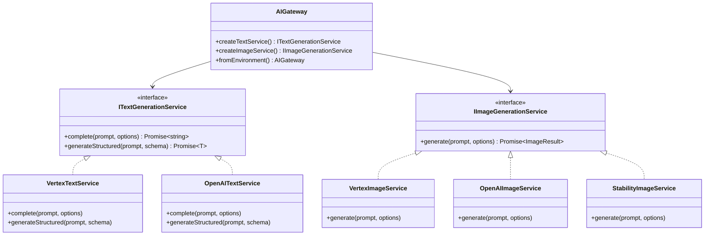
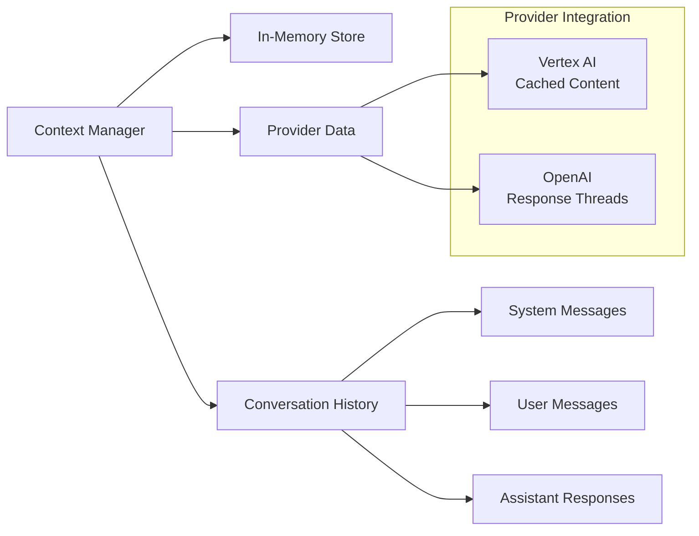
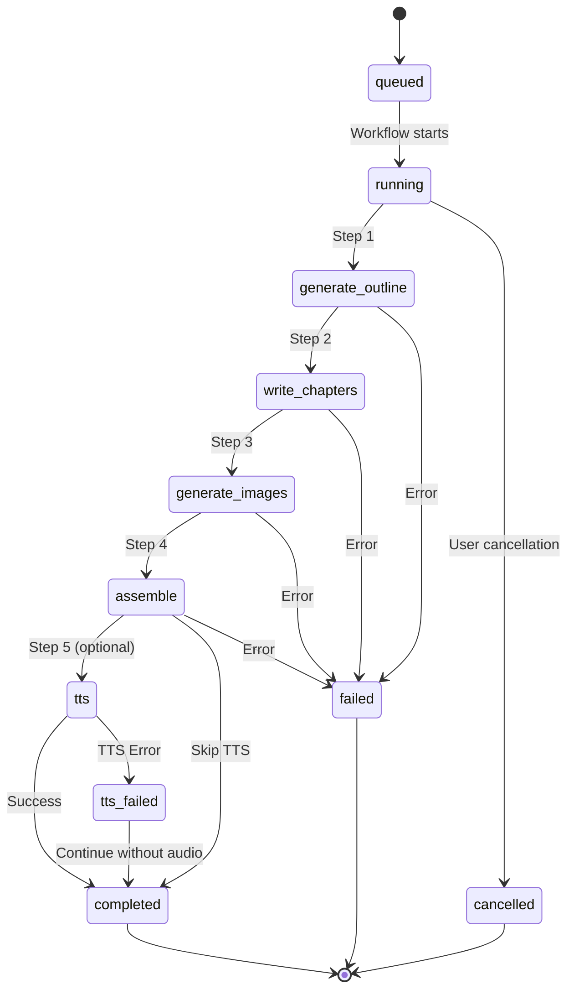

# Story Generation Workflow - Architecture

## Overview

The Story Generation Workflow (SGW) is a provider-agnostic microservice that orchestrates the complete story generation process using Google Cloud Workflows, AI services (Vertex AI, OpenAI, Stability AI), and Cloud Storage. It implements a clean architecture pattern with environment-agnostic business logic and swappable adapters for external services.

## System Architecture



## Workflow Process

The story generation follows a 5-step orchestrated workflow:



## Component Architecture

### 1. AI Gateway (`/src/ai/`)

**Provider-Agnostic AI Service Abstraction**

The AI Gateway implements a facade pattern that abstracts different AI providers behind common interfaces:



**Environment Configuration:**
```bash
TEXT_PROVIDER=vertex|openai
IMAGE_PROVIDER=vertex|openai|stability
```

### 2. Internal API Endpoints (`/src/routes/internal.ts`)

**Database Operations & Run Management**

| Endpoint | Method | Purpose | Database Operation |
|----------|--------|---------|-------------------|
| `/internal/runs/:runId` | PATCH | Update run status/step | UPDATE story_generation_runs |
| `/internal/runs/:runId/outline` | POST | Save story outline | UPDATE stories SET outline |
| `/internal/runs/:runId/chapter/:chapterNum` | POST | Save chapter content | INSERT/UPDATE chapters |
| `/internal/runs/:runId/chapter/:chapterNum/image` | POST | Save image URI | UPDATE chapters SET image_url |

### 3. AI API Endpoints (`/src/routes/ai.ts`)

**AI Gateway Integration**

| Endpoint | Method | Purpose | AI Provider |
|----------|--------|---------|-------------|
| `/ai/text/outline` | POST | Generate story outline | Text Generation Service |
| `/ai/text/chapter/:chapterNum` | POST | Generate chapter content | Text Generation Service |
| `/ai/image` | POST | Generate illustrations | Image Generation Service |

### 4. Context Management System

**AI Context Preservation**



## Project Structure

```
src/
├── config/           # Environment and configuration management
│   ├── database.ts   # Database connection setup
│   ├── environment.ts # Environment validation
│   └── logger.ts     # Winston logging configuration
├── shared/           # Environment-agnostic business logic
│   ├── interfaces/   # TypeScript interfaces and types
│   ├── models/       # Data models and schemas
│   └── utils/        # Pure utility functions
├── adapters/         # External service implementations
│   ├── database/     # Database adapters (Drizzle ORM)
│   ├── storage/      # Cloud Storage adapters
│   └── ai/          # AI service adapters
├── ai/              # AI Gateway and providers
│   ├── gateway.ts   # Main AI Gateway facade
│   ├── providers/   # Provider implementations
│   └── context-manager.ts # Context preservation
├── routes/          # Express route handlers
│   ├── health.ts    # Health check endpoints
│   ├── ai.ts        # AI Gateway endpoints
│   └── internal.ts  # Internal workflow endpoints
├── workflows/       # Google Cloud Workflows handlers
└── db/             # Database schema (shared with mythoria-webapp)
```

## Architecture Principles

### 1. **Single Dockerfile** per microservice
- Distroless base image for security
- Multi-stage builds for optimization
- Reproducible builds using `npm ci`

### 2. **Environment-agnostic logic** in `shared/`
- Pure business logic without external dependencies
- Easy unit testing with mocks
- Clear separation of concerns

### 3. **Interface-based adapters** for external services
- Swappable implementations (database, Google Cloud, AI providers)
- Dependency injection pattern
- Provider-agnostic AI services

### 4. **Observability and Monitoring**
- Structured JSON logging with Winston
- Health check endpoints with dependency checks
- Error tracking and performance metrics
- Context preservation for AI interactions

## Data Flow

### Story Generation Run States



## Security Architecture

### Authentication & Authorization
- Google Cloud IAM for service-to-service communication
- OIDC tokens for Cloud Run authentication
- Principle of least privilege for service accounts

### Data Protection
- Encrypted data in transit (HTTPS/TLS)
- Encrypted data at rest (Google Cloud Storage)
- Input validation with Zod schemas
- SQL injection prevention with Drizzle ORM

### Security Headers
- Helmet.js middleware for security headers
- CORS policy configuration
- Rate limiting (future enhancement)

## Performance Considerations

### Parallel Processing
- Chapter writing executes in parallel (1-N chapters)
- Image generation executes in parallel per chapter
- Google Cloud Workflows native parallel execution

### Caching Strategy
- AI context preservation between requests
- Provider-specific caching (Vertex AI cached content, OpenAI response threads)
- Database connection pooling

### Resource Optimization
- Cloud Run automatic scaling
- Memory-efficient streaming for large responses
- Lazy loading of AI providers

## Error Handling Strategy

### Workflow-Level Error Handling
```yaml
# Google Cloud Workflows error handling
try:
  steps:
    # All workflow steps
except:
  as: error
  steps:
    - logError:
        call: http.request
        args:
          url: ${baseUrl + "/internal/runs/" + runId}
          method: PATCH
          body:
            status: "failed"
            error_message: ${error.message}
    - reraise: ${error}
```

### Application-Level Error Handling
- Structured error responses with error codes
- Retry mechanisms for transient failures
- Graceful degradation for optional features (TTS)
- Comprehensive logging for debugging

## Deployment Architecture

### Google Cloud Services
- **Cloud Run**: Container hosting with automatic scaling
- **Cloud Workflows**: Orchestration engine
- **Cloud Storage**: Asset and content storage
- **Secret Manager**: Secure configuration management
- **Cloud Build**: CI/CD pipeline

### Environment Separation
- **Development**: Local Docker with `.env` files
- **Staging**: Cloud Run with shared secrets
- **Production**: Cloud Run with production secrets and monitoring
