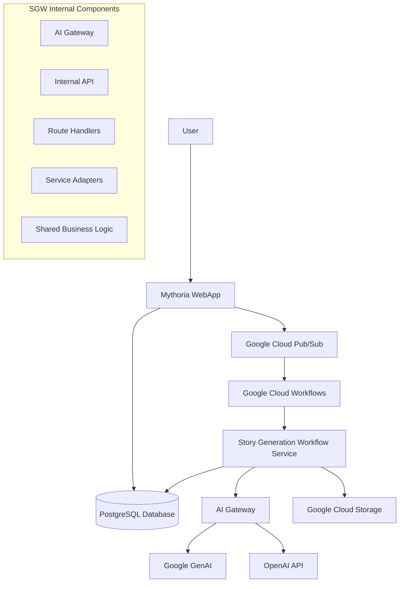
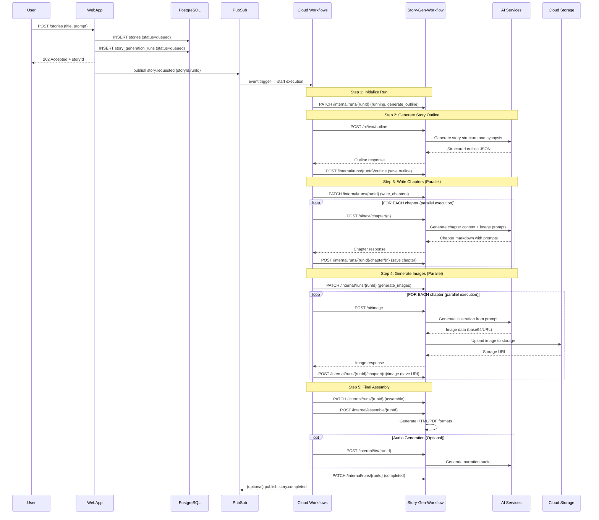
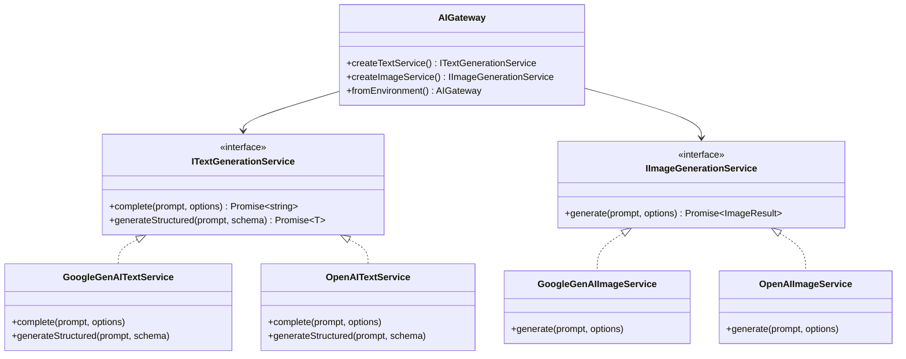
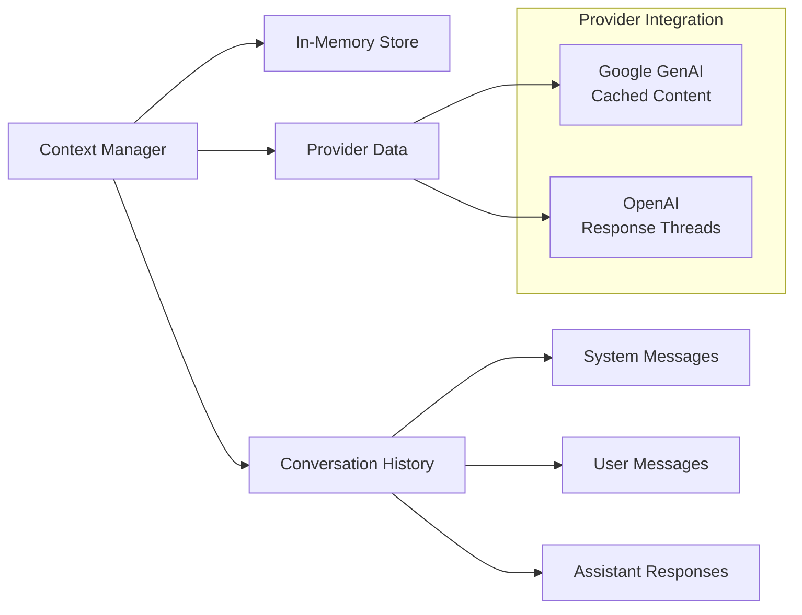
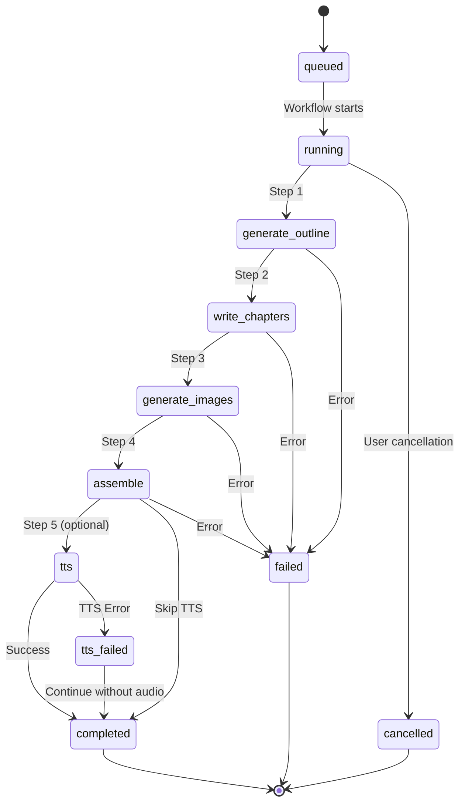

# Story Generation Workflow - Architecture

## Overview

The Story Generation Workflow (SGW) is a provider-agnostic microservice that orchestrates the complete story generation process using Google Cloud Workflows, AI services (Google GenAI and OpenAI), and Cloud Storage. It implements a clean architecture pattern with environment-agnostic business logic and swappable adapters for external services.

## Technology Stack

### Core Technologies

- **Runtime**: Node.js 20+ with ES Modules
- **Language**: TypeScript 5.7.2
- **Framework**: Express.js with async/await patterns
- **Database**: PostgreSQL with Drizzle ORM
- **Testing**: Jest with comprehensive coverage
- **Containerization**: Docker with multi-stage builds

### Google Cloud Platform Services

- **Compute**: Cloud Run (serverless containers)
- **Orchestration**: Cloud Workflows (YAML-defined workflows)
- **AI/ML**: Google GenAI (Gemini models and Imagen)
- **Storage**: Cloud Storage (files, templates, assets)
- **Messaging**: Pub/Sub (event-driven communication)
- **Security**: Secret Manager, IAM service accounts
- **Monitoring**: Cloud Logging, Error Reporting

### External AI Services

- **Primary**: Google GenAI (Gemini 2.5 Flash, Imagen 4.0)
- **Secondary**: OpenAI (GPT-4, DALL-E, Whisper, TTS)

## System Architecture



## Workflow Process

The story generation follows a 5-step orchestrated workflow:



## Component Architecture

### 1. AI Gateway (`/src/ai/`)

**Provider-Agnostic AI Service Abstraction**

The AI Gateway implements a facade pattern that abstracts different AI providers behind common interfaces:



**Environment Configuration:**

```bash
TEXT_PROVIDER=openai|google-genai
IMAGE_PROVIDER=openai|google-genai
GOOGLE_GENAI_IMAGE_MODEL=imagen-4.0-ultra-generate-001
```

### 2. Internal API Endpoints (`/src/routes/internal.ts`)

**Database Operations & Run Management**

| Endpoint                                          | Method | Purpose                | Database Operation            |
| ------------------------------------------------- | ------ | ---------------------- | ----------------------------- |
| `/internal/runs/:runId`                           | PATCH  | Update run status/step | UPDATE story_generation_runs  |
| `/internal/runs/:runId/outline`                   | POST   | Save story outline     | UPDATE stories SET outline    |
| `/internal/runs/:runId/chapter/:chapterNum`       | POST   | Save chapter content   | INSERT/UPDATE chapters        |
| `/internal/runs/:runId/chapter/:chapterNum/image` | POST   | Save image URI         | UPDATE chapters SET image_url |

### 3. AI API Endpoints (`/src/routes/ai.ts`)

**AI Gateway Integration**

| Endpoint                       | Method | Purpose                  | AI Provider              |
| ------------------------------ | ------ | ------------------------ | ------------------------ |
| `/ai/text/outline`             | POST   | Generate story outline   | Text Generation Service  |
| `/ai/text/chapter/:chapterNum` | POST   | Generate chapter content | Text Generation Service  |
| `/ai/image`                    | POST   | Generate illustrations   | Image Generation Service |

### 4. Context Management System

**AI Context Preservation**



## Project Structure

```
src/
├── config/           # Environment and configuration management
│   ├── database.ts   # Database connection setup
│   ├── environment.ts # Environment validation
│   └── logger.ts     # Winston logging configuration
├── shared/           # Environment-agnostic business logic
│   ├── interfaces.ts # Core service interfaces
│   ├── types.ts      # Shared data models
│   └── utils.ts      # Utility helpers
├── adapters/         # External service implementations
│   ├── database/     # Database adapters (Drizzle ORM)
│   ├── storage/      # Cloud Storage adapters
│   └── ai/          # AI service adapters
├── ai/              # AI Gateway and providers
│   ├── gateway.ts   # Main AI Gateway facade
│   ├── providers/   # Provider implementations
│   └── context-manager.ts # Context preservation
├── routes/          # Express route handlers
│   ├── health.ts    # Health check endpoints
│   ├── ai.ts        # AI Gateway endpoints
│   └── internal.ts  # Internal workflow endpoints
├── workflows/       # Google Cloud Workflows handlers
└── db/             # Database schema (shared with mythoria-webapp)
```

## Architecture Principles

### 1. **Single Dockerfile** per microservice

- Distroless base image for security
- Multi-stage builds for optimization
- Reproducible builds using `npm ci`

### 2. **Environment-agnostic logic** in `shared/`

- Pure business logic without external dependencies
- Easy unit testing with mocks
- Clear separation of concerns

### 3. **Interface-based adapters** for external services

- Swappable implementations (database, Google Cloud, AI providers)
- Dependency injection pattern
- Provider-agnostic AI services

### 4. **Observability and Monitoring**

- Structured JSON logging with Winston
- Health check endpoints with dependency checks
- Error tracking and performance metrics
- Context preservation for AI interactions

## Data Flow

### Story Generation Run States



## Security Architecture

### Authentication & Authorization

- Google Cloud IAM for service-to-service communication
- OIDC tokens for Cloud Run authentication
- Principle of least privilege for service accounts

### Data Protection

- Encrypted data in transit (HTTPS/TLS)
- Encrypted data at rest (Google Cloud Storage)
- Input validation with Zod schemas
- SQL injection prevention with Drizzle ORM

### Security Headers

- Helmet.js middleware for security headers
- CORS policy configuration
- Rate limiting (future enhancement)

## Performance Considerations

### Parallel Processing

- Chapter writing executes in parallel (1-N chapters)
- Image generation executes in parallel per chapter
- Google Cloud Workflows native parallel execution

### Caching Strategy

- AI context preservation between requests
- Provider-specific caching (Google GenAI cached content, OpenAI response threads)
- Database connection pooling

### Resource Optimization

- Cloud Run automatic scaling
- Memory-efficient streaming for large responses
- Lazy loading of AI providers

## Error Handling Strategy

### Multi-Layered Retry Strategy

The service implements a comprehensive retry mechanism for transient errors while properly handling permanent failures like safety blocks. The strategy operates at two levels:

#### 1. Workflow Layer (Primary)

Implemented in `workflows/story-generation.yaml` for all image generation operations:

**Retry Configuration:**
- **Max Attempts**: 3 per image
- **Retry Delay**: 60 seconds (fixed, no exponential backoff at workflow level)
- **Scope**: Front cover, back cover, and all chapter images

**Retryable Errors:**
- HTTP 500 (Internal Server Error)
- HTTP 503 (Service Unavailable)
- HTTP 429 (Rate Limit Exceeded)
- Network timeouts and connection errors

**Non-Retryable Errors:**
- HTTP 422 (Safety Block) - triggers prompt rewrite instead
- HTTP 400 (Bad Request) - invalid parameters
- HTTP 401/403 (Authentication errors)

**Example Workflow Retry Loop:**
```yaml
- genFrontCover:
    try:
      steps:
        - initFrontCoverRetry:
            assign:
              - frontCoverMaxAttempts: 3
              - frontCoverRetryDelay: 60
              - frontCoverSuccess: false
        - frontCoverRetryLoop:
            for:
              value: attempt
              range: ${[1, frontCoverMaxAttempts]}
              steps:
                - tryFrontCoverGeneration:
                    try:
                      steps:
                        - frontCoverRequest:
                            call: http.request
                            args:
                              url: ${baseUrl + "/ai/image"}
                              # ... request body
                        - breakOnSuccess:
                            next: storeFrontCoverResult
                    except:
                      as: frontCoverAttemptError
                      steps:
                        - checkErrorType:
                            switch:
                              # Safety block - exit to prompt rewrite
                              - condition: ${frontCoverAttemptError.code == 422}
                                next: markRunBlockedFrontCover
                              # Last attempt - fail
                              - condition: ${attempt >= frontCoverMaxAttempts}
                                raise: ${frontCoverAttemptError}
                        # Retryable error - delay and retry
                        - delay:
                            call: sys.sleep
                            args:
                              seconds: ${frontCoverRetryDelay}
```

#### 2. Safety Block Handling (Phase 2)

When an image generation request is blocked by AI safety systems (HTTP 422 or 400 with `moderation_blocked`), the service automatically attempts to rewrite the prompt using Google GenAI:

**Rewrite Process:**
1. **Detect Safety Block**: Route detects 422 status or moderation error codes
2. **Load Rewrite Template**: Use `src/prompts/en-US/image-prompt-safety-rewrite.json`
3. **Call GenAI**: Request prompt rewrite with safety guidelines
4. **Single Retry**: Attempt image generation once with rewritten prompt
5. **Final Failure**: If still blocked, mark run as 'blocked' status

**Prompt Rewrite Template Variables:**
```typescript
{
  safetyError: "The exact error message from AI safety system",
  imageType: "front_cover | back_cover | chapter",
  bookTitle: "Title of the book",
  graphicalStyle: "Visual style (e.g., 'Pixar style')",
  chapterNumber: "Chapter number if applicable",
  originalPrompt: "The original blocked prompt"
}
```

**Safety Rewrite Guidelines:**
- Avoid sensitive terms (intimate, exposed, bare, hatching)
- Add contextual safety markers (classroom, zoo, museum)
- Change camera angles (distant/medium vs close-up)
- Generalize specific details
- Focus on actions/emotions over physical attributes
- Use indirect descriptions ("nearby" vs "holding")

#### 3. Application Layer (Utility)

`src/shared/retry-utils.ts` provides utility functions for error classification:

```typescript
// Classify errors
isSafetyBlockError(error): boolean   // 422, moderation_blocked
isTransientError(error): boolean     // 500, 503, 429, timeouts

// Retry wrapper (currently used for reference, workflow handles retries)
withRetry<T>(fn: () => Promise<T>, options: RetryOptions): Promise<T>
```

#### 4. Error Response Handling

**422 Response (Safety Block after rewrite failure):**
```json
{
  "success": false,
  "error": "SAFETY_BLOCKED: Your request was rejected by the safety system",
  "failedAt": "generating_image",
  "code": "IMAGE_SAFETY_BLOCKED",
  "category": "safety_blocked",
  "provider": "openai",
  "promptRewriteAttempted": true,
  "promptRewriteError": "Still blocked after rewrite",
  "requestId": "5159ede1-16d3-4359-9766-671cf539339f",
  "timestamp": "2025-10-10T12:44:15.040Z"
}
```

**500 Response (Transient error after 3 retries):**
```json
{
  "success": false,
  "error": "Service unavailable, max retries exceeded",
  "failedAt": "generating_image",
  "requestId": "...",
  "timestamp": "..."
}
```

### Workflow Error States

The workflow marks runs with appropriate status codes:

| Status | Trigger | Description | User Action |
|--------|---------|-------------|-------------|
| `blocked` | 422 after prompt rewrite | Safety system rejected content | Review/adjust story content |
| `failed` | 500/503 after 3 retries | Service error, transient failure | Retry story generation |
| `failed` | Other errors | Unexpected failure | Contact support |
| `completed` | Success | All steps completed | N/A |

### Workflow-Level Error Handling

```yaml
# Google Cloud Workflows error handling (outer try/catch)
try:
  steps:
    # All workflow steps (outline, chapters, images)
except:
  as: wfError
  steps:
    - markFailedRun:
        call: http.request
        args:
          url: ${baseUrl + "/internal/runs/" + runId}
          method: PATCH
          body:
            status: 'failed'
            currentStep: 'unknown'
            errorMessage: ${wfError.message}
            endedAt: ${time.format(sys.now())}
    - rethrow:
        raise: ${wfError}
```

### Debugging Failed Workflows

**Check Workflow Logs:**
```powershell
npm run logs
# or
gcloud logging read "resource.type=cloud_run_revision AND resource.labels.service_name=story-generation-workflow" --limit=100
```

**Check Run Status:**
```sql
SELECT id, status, current_step, error_message, started_at, ended_at
FROM story_generation_runs
WHERE id = '<runId>';
```

**Common Issues:**
- **Multiple 422 responses**: Prompt contains inherently unsafe content - manual review needed
- **Timeout after 3 attempts**: Provider overload - retry story generation
- **500 from /ai/image**: Check Cloud Run logs for application errors

## Deployment Architecture

### Google Cloud Services

- **Cloud Run**: Container hosting with automatic scaling
- **Cloud Workflows**: Orchestration engine
- **Cloud Storage**: Asset and content storage
- **Secret Manager**: Secure configuration management
- **Cloud Build**: CI/CD pipeline

### Environment Separation

- **Development**: Local Docker with `.env` files
- **Staging**: Cloud Run with shared secrets
- **Production**: Cloud Run with production secrets and monitoring
