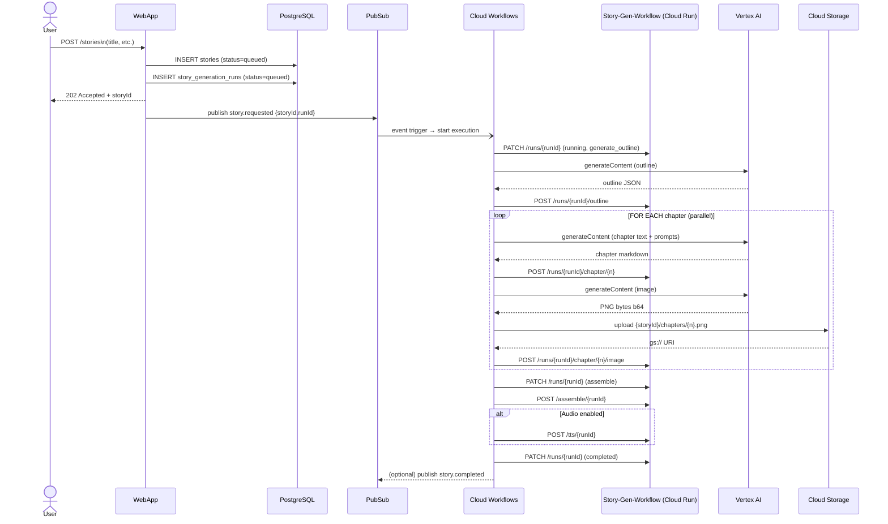
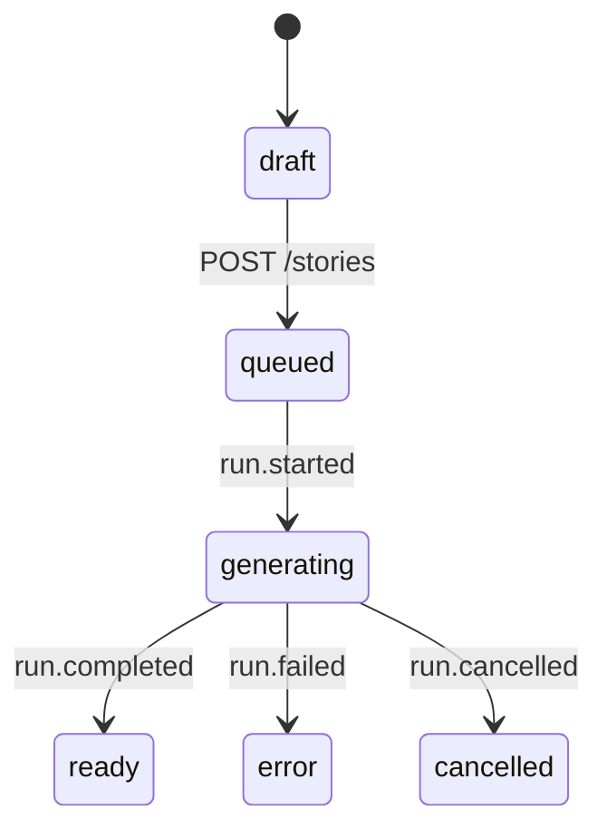
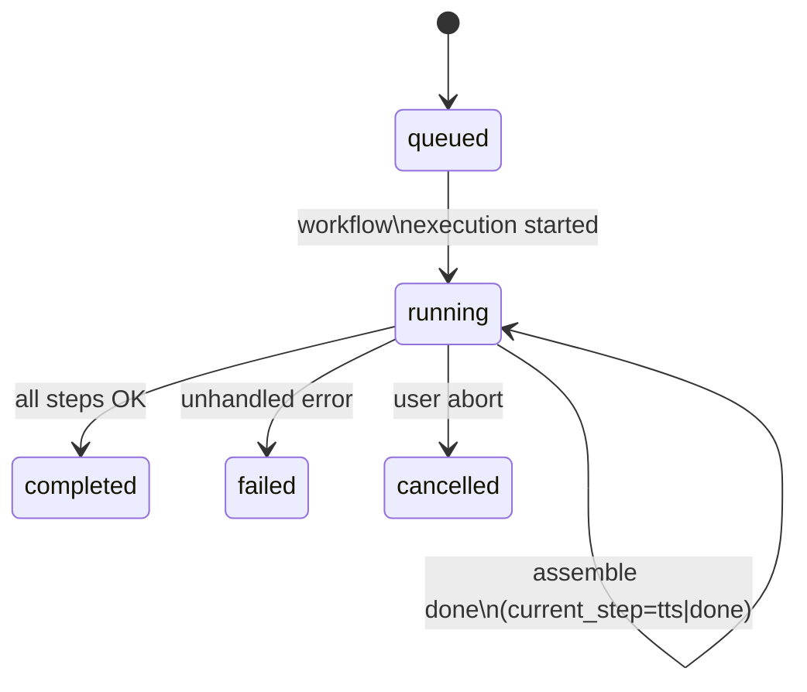

--------------------------------------------------------------------
1.  HIGH-LEVEL WORKFLOW PROCESS
--------------------------------------------------------------------

ENTRY POINT
───────────
Step 0 happens inside the Mythoria Webapp (**not** in the Workflow):

0. User clicks “Generate story”  
   → POST /stories (webapp)  
   → Webapp inserts a **stories** row (status = ‘queued’) + a
     **story_generation_runs** row (status = ‘queued’)  
   → Webapp publishes a Pub/Sub message
     topic = `mythoria.story.requests`, payload = {storyId, runId}

This message is the **event trigger** for Google Workflows.  
Everything that follows (steps 1-7) is executed fully managed by
Workflows.

STEPS INSIDE THE WORKFLOW
─────────────────────────
The column “Function / resource” references either:

• vertex.ai API methods  
• Cloud Run internal endpoints you implement in the
  `story-generation-workflow` service (SGW)  
• Cloud Storage JSON/Blob operations

| # | Purpose                                   | Function / resource called                          | Runs table patch (`story_generation_runs`) |
|---|-------------------------------------------|-----------------------------------------------------|--------------------------------------------|
| 1 | Mark run started                          | SGW: PATCH /internal/runs/{runId}                   | status=running, current_step=generate_outline |
| 2 | Generate global outline                   | Vertex AI: `generateContent` (Gemini-Pro)           | – |
| 3 | Persist outline                           | SGW: POST /internal/runs/{runId}/outline            | current_step=write_chapters                |
| 4 | For each chapter **in parallel**          | Loop 1-N                                            | – |
| 4a| - write chapter text + prompts            | Vertex AI: `generateContent`                        | – |
| 4b| - save chapter text                       | SGW: POST /internal/runs/{runId}/chapter/{n}        | – |
| 4c| - generate 1st illustration               | Vertex AI image model `imagegeneration@001`         | – |
| 4d| - upload PNG to GCS                       | GCS: objects.insert                                 | – |
| 4e| - persist image URI                       | SGW: POST /internal/runs/{runId}/chapter/{n}/image  | – |
| 5 | Mark “assembling”                         | SGW: PATCH /internal/runs/{runId}                   | current_step=assemble                      |
| 6 | Build final HTML/PDF                      | SGW: POST /internal/assemble/{runId}                | – |
| 7 | Optional TTS                              | SGW: POST /internal/tts/{runId} (wrapped in try/except) | If fails → current_step=tts_failed         |
| 8 | Mark completed / failed / cancelled       | SGW: PATCH /internal/runs/{runId}                   | status = completed or failed, ended_at     |

ERROR HANDLING  
If **any** uncaught error bubbles up inside Workflows, the
`on_error` block:

1. PATCHes the run row → status = failed, current_step = <step-name>,
   error_message = stacktrace.  
2. Rethrows → the Workflow execution is marked **FAILED** in GCP
   console.

SEQUENCE DIAGRAM (Mermaid)
──────────────────────────

--------------------------------------------------------------------
2.  STORY STATE MACHINE
--------------------------------------------------------------------

We keep **two levels** of state:

A.  `story_generation_runs.status`  – execution-level status  
B.  `stories.status` (optional convenience) – high-level story status
    visible in the product UI.  
    It is derived but we still store it for easy queries.

━━━━━━━━━━━━━━━━━━━━━━━━━━━━━━━━━━━━━━━━━━━━━━━━━━━━━━━━━━━━━━
A. Run-level transitions (fine grain)
━━━━━━━━━━━━━━━━━━━━━━━━━━━━━━━━━━━━━━━━━━━━━━━━━━━━━━━━━━━━━━
| From        | Event / Step                          | To          |
|-------------|---------------------------------------|-------------|
| queued      | Workflow starts                       | running     |
| running     | generate_outline **succeeds**         | running + current_step=write_chapters |
| running     | all chapters + images done            | running + current_step=assemble |
| running     | assemble complete                     | running + current_step=tts (or done) |
| running     | tts complete OR skipped               | completed   |
| running     | any uncaught exception                | failed      |
| running     | manual abort from UI / admin          | cancelled   |

━━━━━━━━━━━━━━━━━━━━━━━━━━━━━━━━━━━━━━━━━━━━━━━━━━━━━━━━━━━━━━
B. Story-level transitions (coarse grain)
━━━━━━━━━━━━━━━━━━━━━━━━━━━━━━━━━━━━━━━━━━━━━━━━━━━━━━━━━━━━━━
| From   | Trigger                                         | To          |
|--------|-------------------------------------------------|-------------|
| draft  | Author clicks “Generate”                        | queued      |
| queued | Run status → running                            | generating  |
| generating | Run status → completed                      | ready       |
| generating | Run status → failed                         | error       |
| generating | Run status → cancelled                      | cancelled   |

Mermaid state diagram (story-level)
───────────────────────────────────

(Optional) Mermaid state diagram (run-level)
────────────────────────────────────────────

